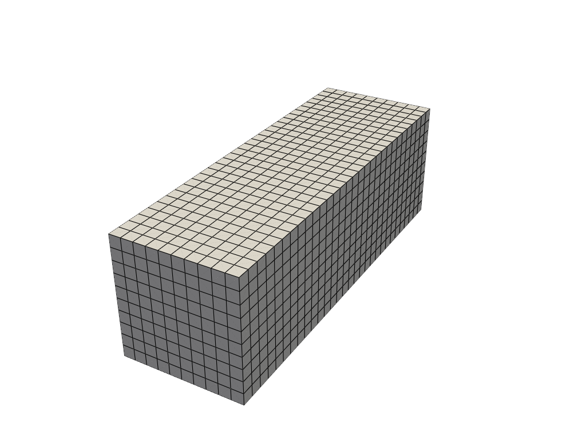
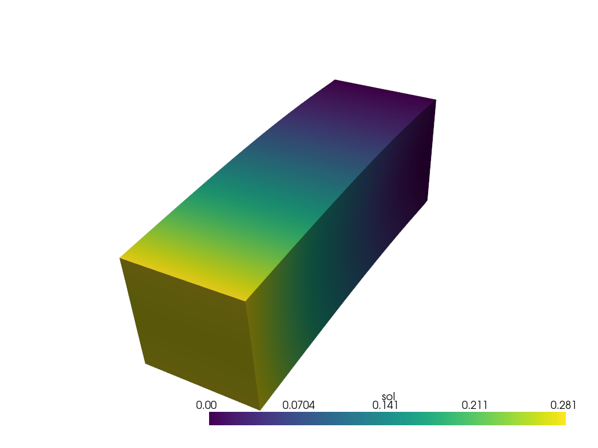
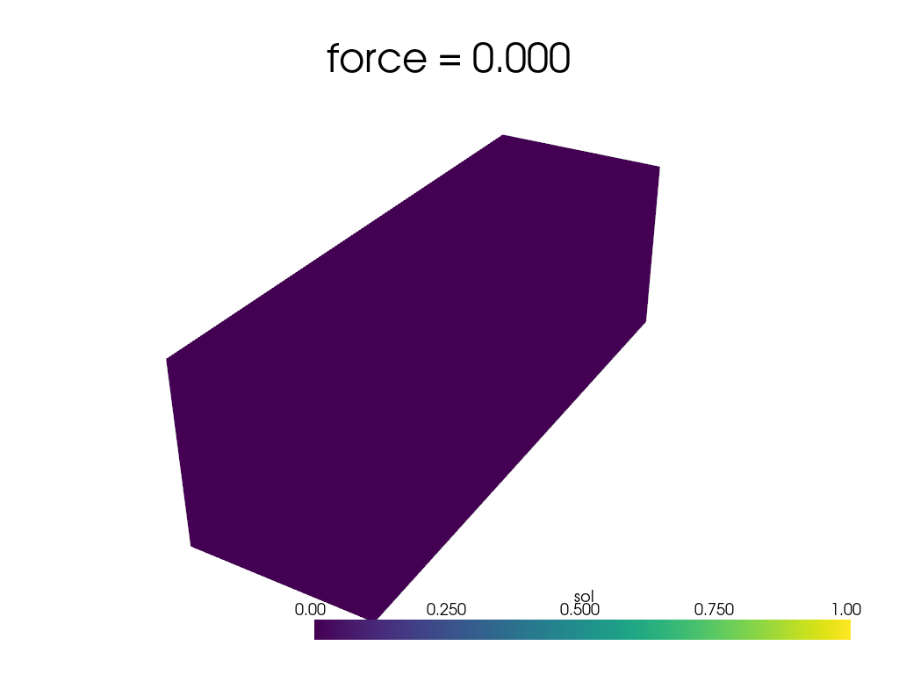

# Bending Beam

Here, we will solve a bending beam problem. This incorporates both Neumann and Dirichlet boundary conditions for a nonlinear material model.

## Implementation

To begin, we import the packages that will be used

```python
import jax
import jax.numpy as np

from cardiax import box_mesh
from cardiax import Problem
from cardiax import Newton_Solver
from cardiax import FiniteElement
```

Now that we've imported the appropriate packages, we will define the PDE. The left-hand side of the mathematical description,

$$
\int_{\Omega_0} \mathbf{P} : \nabla \mathbf{v} dV,
$$

is incorporated by computing the corresponding "kernel." Since we are contracting $\mathbf{P}$ against the gradient of the test function, we must use `get_tensor_map`. To compute $\mathbf{P}$, we leverage the autodiff capabilities of JAX's `grad` function and just need to define the strain energy density function. This choice greatly simplifies changing material models since tensor forms don't have to be manually derived.

Lastly, we want to compute a surface integral for the traction where the boundary will be defined as the top surface,

$$
\int_{\Gamma} \mathbf{t} \cdot \mathbf{v} dS.
$$

This term will be incorporated into `get_surface_maps` as follows.

```python
class HyperElasticity(Problem):

    def get_tensor_map(self):

        def psi(F):
            E = 10.
            nu = 0.3
            mu = E / (2. * (1. + nu))
            kappa = E / (3. * (1. - 2. * nu))
            J = np.linalg.det(F)
            I1 = np.trace(F.T @ F)
            energy = (mu / 2.) * (I1 - 3. - 2 * np.log(J)) + (kappa / 2.) * (J - 1.)**2.
            return energy

        P_fn = jax.grad(psi)

        def first_PK_stress(u_grad):
            I = np.eye(u_grad.shape[0])
            F = u_grad + I
            P = P_fn(F)
            return P

        return first_PK_stress
    
    def get_surface_maps(self):

        def surface_map(u, u_grad, x, t):
            return np.array([t[0], 0., 0.])
                
        return {"u": {"top": surface_map}}
```

To create the beam, we generate a box mesh with one direction longer and with more elements than the other two. The problem is simple enough that we can solve it with linear hexahedrons.

```python
# Specify mesh-related information (first-order hexahedron element).
mesh = box_mesh(Nx=10, Ny=10, Nz=30, Lx=1., Ly=1., Lz=3.)
fe = FiniteElement(mesh, vec = 3, dim = 3, ele_type = "hexahedron", gauss_order = 1)
```

We now have this mesh for the beam:


Now we define the appropriate boundaries for the boundary value problem. We want to fix the bottom of the beam. Notice that the `top` function matches the key of the dictionary being returned from the `get_surface_maps`.

```python
# Define boundary locations.
def bottom(point):
    return np.isclose(point[2], 0., atol=1e-5)

def top(point):
    return np.isclose(point[2], 3., atol=1e-5)
```

Now we define a zero-value function for the Dirichlet BCs to fix the bottom of the beam in the x, y, and z directions. The `location_fn` is then defined to be the top surface where the traction is applied.

```python
# Define Dirichlet boundary values.
def zero_dirichlet_val(point):
    return 0.

bc1 = [[bottom] * 3, [0, 1, 2],
        [zero_dirichlet_val] * 3]
dirichlet_bc_info = {"u": [bc1]}
location_fns = {"u": {"top": top}}
```

We now initialize the hyperelastic problem over the appropriate FE field with the desired boundary restrictions.

```python
problem = HyperElasticity({"u": fe},
                          dirichlet_bc_info=dirichlet_bc_info,
                          location_fns=location_fns)
```

With the problem defined, we need to fill in what the value of the traction should be. Now we use the `set_internal_vars_surfaces` method to appropriately shape the input for the computation.

```python
force = 0.025
problem.set_internal_vars_surfaces({"u": {"top": {"t": np.array([force])}}})
```

Lastly, we initiate the solver and solve.

```python
solver = Newton_Solver(problem, np.zeros((problem.num_total_dofs_all_vars)))

sol0, info = solver.solve(max_iter=50)
assert info[0]
```

This gives us the solution


Now, if you would like to obtain a movie showing the motion as the traction is built up, we solve over the range of traction values. Since the traction loading is continuous with respect to the solution in this example, we can use the previous solution state as the new initial guess for the next forward solve with `solver.initial_guess = sol`. Since the main assumption of Newton-Raphson iteration is the intial guess being sufficiently close to the solution, this one line offers major benefits when solving sequential problems.

```python
sols = []
forces = np.linspace(0, .025, 21, endpoint=True)
for f in forces:
    problem.set_internal_vars_surfaces({"u": {"top": {"t": np.array([f])}}})
    sol, info = solver.solve(max_iter=50)
    assert info[0]
    solver.initial_guess = sol
    sols.append(sol)
```

Displaying these solutions gives us the following

