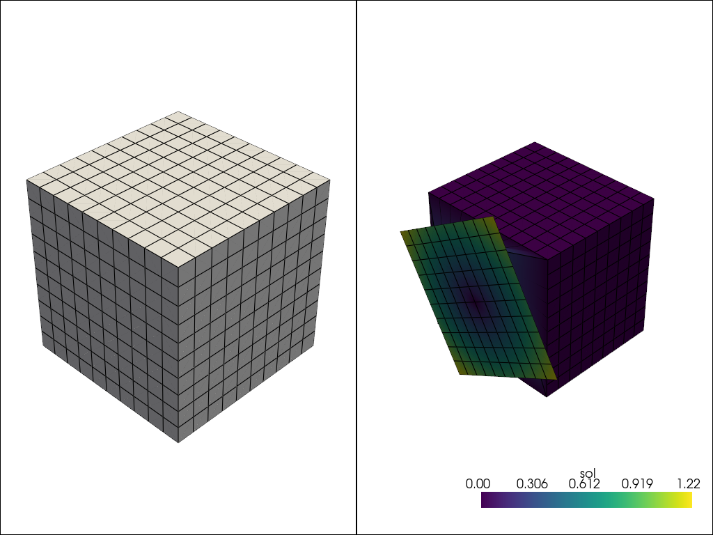
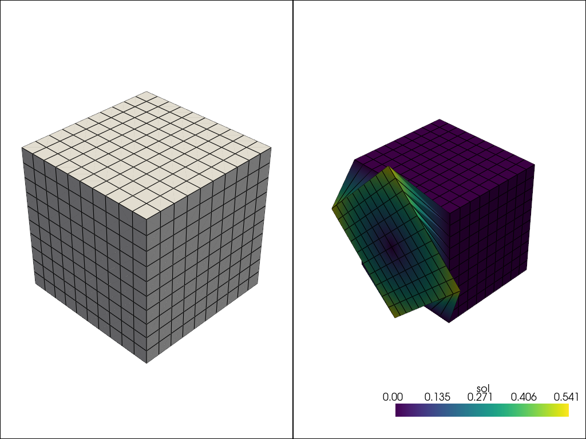
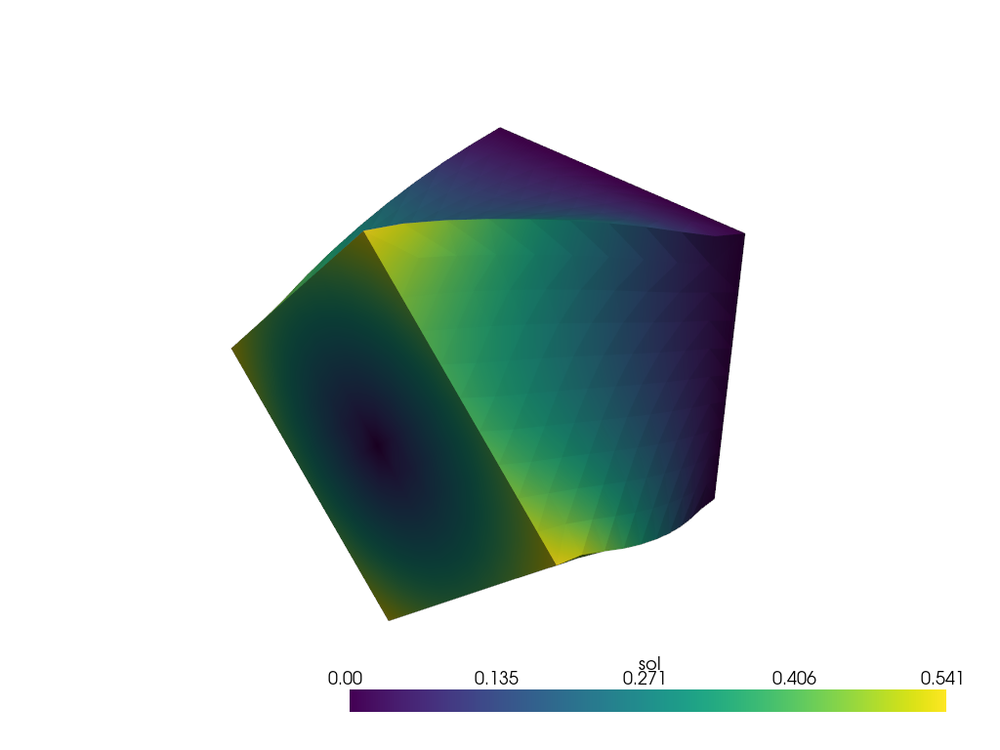

# Cube Twist

Moving from the bending beam problem, we will now showcase twisting a cube. This example was chosen to demonstrate how to inspect a mesh if simulations fail.

## Implementation

The imports are the same as before. The material model is also the same, we just removed the surface function describing the traction.

```python
class HyperElasticity(Problem):

    def get_tensor_map(self):

        def psi(F):
            E = 10.
            nu = 0.3
            mu = E / (2. * (1. + nu))
            kappa = E / (3. * (1. - 2. * nu))
            J = np.linalg.det(F)
            I1 = np.trace(F.T @ F)
            energy = (mu / 2.) * (I1 - 3. - 2 * np.log(J)) + (kappa / 2.) * (J - 1.)**2.
            return energy

        P_fn = jax.grad(psi)

        def first_PK_stress(u_grad):
            I = np.eye(u_grad.shape[0])
            F = u_grad + I
            P = P_fn(F)
            return P

        return first_PK_stress
```

The mesh is now generating a cube rather than the beam done previously.

```python
# Specify mesh-related information (first-order hexahedron element).
mesh = box_mesh(Nx=10, Ny=10, Nz=10, Lx=1., Ly=1., Lz=1.)
fe = FiniteElement(mesh, vec = 3, dim = 3, ele_type = "hexahedron", gauss_order = 1)
```

The boundary conditions are now grabbing the left and right face rather than top and bottom.

```python
# Define boundary locations.
def left(point):
    return np.isclose(point[0], 0., atol=1e-5)

def right(point):
    return np.isclose(point[0], 1., atol=1e-5)
```

The dirichlet boundary values are more complex now. We are twisting the right face by an angle of $\theta = \pi/2$ while the left is held fixed. So we have two value functions that represent the rotation applied to the face with the rotation center at (0.5, 0.5) in the y and z coordinates.

```python
# Define Dirichlet boundary values.
def zero(point):
    return 0.

theta = np.pi / 2.
def val0(point):
    return (point[1]-.5)*(np.cos(theta)-1) - (point[2]-.5)*np.sin(theta)

def val1(point):
    return (point[1]-.5)*np.sin(theta) + (point[2]-.5)*(np.cos(theta)-1)

bc_left = [
    [left] * 3,
    [0, 1, 2],
    [zero, zero, zero]
    ]
bc_right = [
    [right] * 3, 
    [0, 1, 2],
    [zero, val0, val1]
    ]

dirichlet_bc_info = {"u": [bc_left, bc_right]}
```

We now initialize the problem with only dirichlet boundary conditions.

```python
problem = HyperElasticity({"u": fe},
                          dirichlet_bc_info=dirichlet_bc_info)
```

A very important step when applying more complex dirichlet boundary conditions is inspecting the effect of these boundary conditions before solving. To inspect appropriately, we need to get the boundary data that is used to apply the lift. From `get_boundary_data`, we now have access to the global indices and values that are being set, so we just have to make a zero vector and apply the lift.

```python
zero_sol = np.zeros((problem.num_total_dofs_all_vars))
bc_inds, bc_vals = problem.get_boundary_data()
zero_sol = zero_sol.at[bc_inds].set(bc_vals)
```

We can now view this lifted representation to see what is being treated as the initial state of the solver.



Depending on if the solve fails or not, you may need to build up the dirichlet displacements to prevent too much distortion. Now let's see if the solve holds.

```python
solver = Newton_Solver(problem, np.zeros((problem.num_total_dofs_all_vars)))
sol, info = solver.solve(max_iter=10)
assert info[0]
```

This time, the assertion fails. This means that the Newton solve failed to converge to the desired tolerance within the specified number of iterations. Determining why the solve failed for generic problems can be very difficult. Given the setup, we know failure occurred because of the over-twisting of the cube, and we get this error message:

```
Traceback (most recent call last):
  File "tutorials/Introductory/neohookean/dirichlet_cube.py", line 74, in <module>
    assert info[0]
           ~~~~^^^
AssertionError
```

The code is run again just modifying the value of $\theta = \pi/4$ to obtain this initial state



Now we can successfully solve the problem obtaining the following solution.


