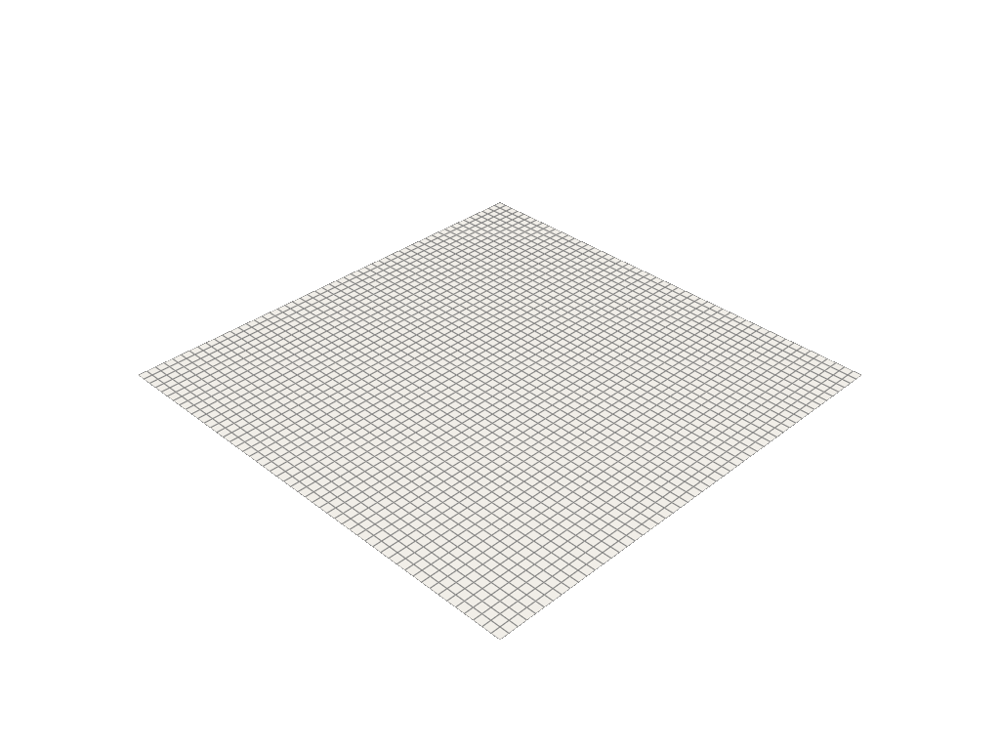

# The Poisson Equation

## Mathematical description

Here, we will demonstrate how to solve the Poisson equation in the `cardiax` framework. The Poisson equation is defined as

$$
- \Delta u = f
$$

where we take $u \in H^2(\Omega)$ (for simplicity) and $f \in L^2(\Omega)$. Thus, we have an operator, $\mathcal{L}: H^2(\Omega) \rightarrow L^2(\Omega)$ defined by the laplacian. Now, we define what is called a distrubtion (ie weak form) by integrating after multiplying with a suitable test function. This gives us

$$
\int_\Omega \Delta u v dV = \int_\Omega f v dV
$$

then integrating by parts to move the derivative to the test function, we have

$$
\int_\Omega \nabla u \cdot \nabla v dV - \int_{\partial \Omega} v \nabla u \cdot \mathbf{n} dS = \int_\Omega f v dV
$$

These are the simple equations that are described at a continuous level. Now we must discretize to be able to solve this problem. The following generalization of the above is typically written to describe these equations

$$
b(u, v) = l(v)
$$

where $b$ is a bilinear form of the trial function $u$ and test function $v$ while the righthand side is a linear form $l$ of $v$ only.

## Discretization

For simplicity, let's restrict $\Omega$ to be a unit square, $\mathbf{x} \in [0, 1] \times [0, 1]$. Now, we can create a structured grid to represent the mesh where we subdivide the square into say a 50 x 50 cell domain, which is what we'll use to approximate the solution of the PDE.

By deconstructing the domain $\Omega$ into many pieces $\Omega_i$, we can now break up the integrals through additivity

$$
\sum_i \left( \int_{\Omega_i} \nabla u \cdot \nabla v dV - \int_{\partial {\Omega_i}} v \nabla u \cdot \mathbf{n} dS \right) = \sum_i \int_{\Omega_i} f v dV
$$

After breaking up the mesh, we need to break up the functions we want to approximate. Thus, we choose an element which for this case will be a Lagrange basis on quadrilaterals. This defines the shape functions represented in each cell $\Omega_i$. The shape functions only have support over the cell they are defined, so each integral in the sum can be evaluated with its corresponding basis functions. Thus, we make the following substitution

$$
u(x) = \sum_j u_j \varphi_j(x) \quad v = \sum_k \varphi_k(x) \quad f = \sum_l f(x) \varphi_l(x)
$$

where $v$ is chosen to be an arbitrary function in the same discretized space as $u$. The goal is to find the combinations of $c_j$ that give us an accurate approximation of the PDE. In all, we can write the system as

$$
\sum_i \left( \int_{\Omega_i} \nabla (\sum_j u_j \varphi_j) \cdot \nabla (\sum_k \varphi_k) dV - \int_{\partial {\Omega_i}} (\sum_k \varphi_k) \nabla (\sum_j u_j \varphi_j) \cdot \mathbf{n} dS \right) = \sum_i \int_{\Omega_i} (\sum_l f_l \varphi_l) (\sum_k \varphi_k) dV
$$

We have now discretized the bilinear form mentioned earlier. This discretization leads to the matrix system

$$
B \mathbf{u} = L
$$

where we are solving for a vector of the $u_j$ values. The matrix $B$ is formed through the inner products of the test functions with each other, and the linear part is just the inner product between the forcing function and test function. Since the shape functions are only defined over the cells, this gives us a sparse system to solve.

## Implementation

Now that we have defined the problem and its discretization, we will demonstrate this procedure in the `cardiax` framework. The following notebooks will increase in difficulty, demonstrating different aspects of the PDE. It's recommended to go in this order:

- isotropic
- anisotropic
- boundary_fn
- combined

Only the code that changes from the previous example will be included to keep only relevant information in each tutorial. All code for the tutorials can be found in the folder /CARDIAX/tutorials/...