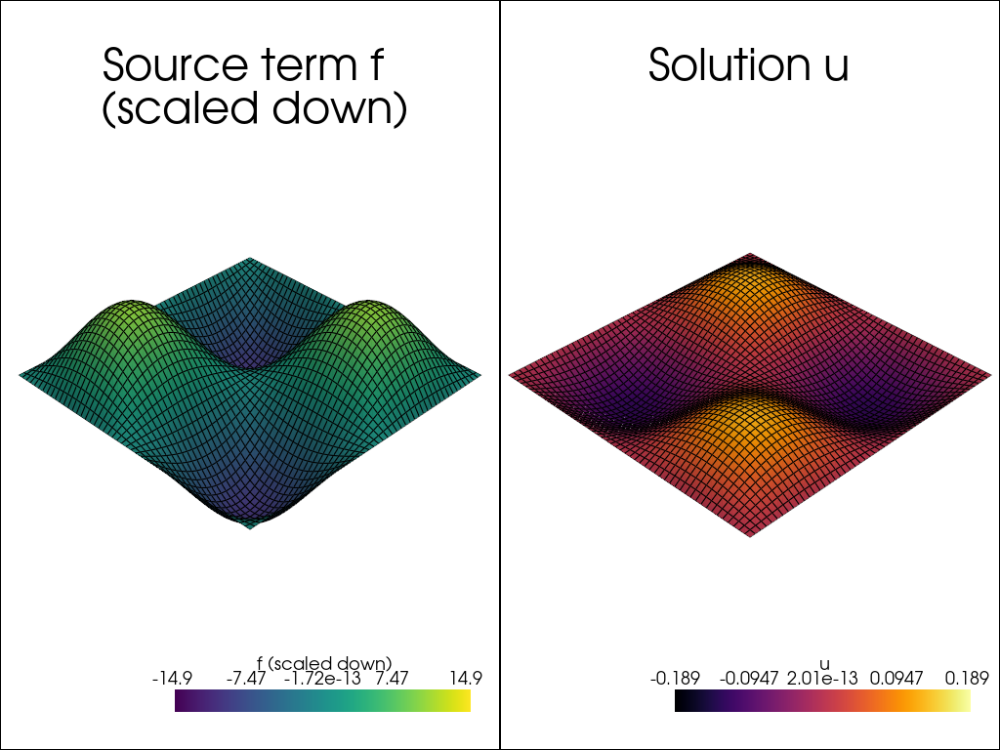

# Isotropic Poisson

For the isotropic poisson equation, we will be solving for the eigenfunction. If you aren't familiar, sinusoids of appropriate period are the eigenfunctions of the laplace equation ie. the solution is a scalar multiple of the forcing function. We will be setting boundary conditions to be dirichlet with value $0$ on all edges and set an appropriate sinusoid as the forcing.

$$
\int_\Omega \nabla u \cdot \nabla v dV = \int_\Omega sin(2\pi x) sin(2\pi y) v dV
$$

## Imports
For imports, we recommend always setting jax.numpy as np for users unfamiliar with jax, and only using regular numpy when needed. We will also time solutions for later demonstration. From cardiax, we import `rectangle_mesh` to create the mesh for the unit square. Then we require `FiniteElement` to define the shape functions over the domain, `Problem` used for the assembly of the matrix-vector system, and lastly, `Newton_Solver` as the default solver for the matrix system. If you're aware, `Newton_Solver` is techincally overkill since it's a linear problem, but it will just terminate in one iteration.

```python
# Import some generally useful packages.
import jax.numpy as np
import time

from cardiax import rectangle_mesh
from cardiax import FiniteElement, Problem, Newton_Solver
```

## Finite Element Discretization

Here, we create the mesh on a unit cube. By default, `rectangle_mesh` returns quads, so these are the `ele_type` to give to `FiniteElement`. We must also define `vec` which is the dimension of the solution function, 1, the `dim` or dimension of the mesh, 2, and the `gauss_order` to define the level of integration to be used.

```python
# Create the mesh and FE field
Lx, Ly = 1., 1.
mesh = rectangle_mesh(Nx=50, Ny=50, Lx=Lx, Ly=Ly)
fe = FiniteElement(mesh, vec=1, dim=2, ele_type="quad", gauss_order=1)
```

## PDE Definition

We utilize inheritance to specify the PDE since the `Problem` class works in the generality of the bilinear and linear form mentioned previously. We then have a choice of predefined kernels that can be evaluated:

$$
\begin{aligned}
    \texttt{get_tensor_map}(u\_grad) &:= \int_\Omega (u\_grad) \cdot \nabla v dV \\\\
    \texttt{get_mass_map}(u, u\_grad, x) &:= \int_\Omega f(u, u\_grad, x) v dV \\\\
    \texttt{get_surface_maps}(u, u\_grad, x) &:= \int_{\partial \Omega} v g(u, u\_grad, x) \cdot \mathbf{n} dS
\end{aligned}
$$

For our problem, we need to fill in the `get\_tensor\_map` and `get\_mass\_map`. Since we have dirichlet boundary conditions, these appear through lifting the solution by a constant after the solve, so we have no surface maps defined. Also pay attention to the variables that are predetermined as inputs.

```python
# Define the Poisson problem
class Poisson(Problem):

    # Defines the contraction between
    # \int \nabla u \cdot \nabla v dx
    # You're entering the "\nabla u" part, the "\cdot \nabla v" is fixed
    def get_tensor_map(self):
        return lambda u_grad: u_grad
    
    # Define the source term f
    # For the Poisson problem, using eigenfunction here
    def get_mass_map(self):
        def mass_map(u, u_grad, x):
            val = -10 * np.array([np.sin(2 * x[0] * np.pi) * np.sin(2 * x[1] * np.pi)])
            return val
        return mass_map
```

## Boundary Conditions

### Identification

Now that we have the mesh and PDE defined, we need to be able to apply the dirichlet boundary conditions. We must identify what the boundaries are, so we know which DoFs to augment. Here, we define location functions which return True or False for whether or not the point is located on the boundary. We then define a function to return the value to assign to the DoF.

```python
# Define boundary locations.
def left(point):
    return np.isclose(point[0], 0., atol=1e-5)

def right(point):
    return np.isclose(point[0], Lx, atol=1e-5)

def bottom(point):
    return np.isclose(point[1], 0., atol=1e-5)

def top(point):
    return np.isclose(point[1], Ly, atol=1e-5)

# Define boundary values to assign (homogeneous)
def zero_bc(point):
    return 0.
```

### Assignment

To assign the boundary conditions, we create lists that will be unpacked appropriately. Each boundary condition contains three lists: [location], [DoF vec], [value]. For instance bc_left is the left boundary condition that assigns the first vec component (trivial setting since vec=1) the value of 0. We then pack all the boundary conditions together and assign them to $u$ in a dictionary.

```python
# Combine BC info
bc_left = [[left], [0], [zero_bc]]
bc_right = [[right], [0], [zero_bc]]
bc_top = [[top], [0], [zero_bc]]
bc_bottom = [[bottom], [0], [zero_bc]]
dirichlet_bc_info = {"u": [bc_left, bc_right, bc_top, bc_bottom]}
```

## Problem Creation

Now the hard work is done, we just stay consistent saying that the finite element field we defined also belongs to $u$ and assign the dirichlet_bc_info. This initiates the specialized `Problem` class and starts precomputing necessary values.

```python
problem = Poisson({"u": fe}, dirichlet_bc_info=dirichlet_bc_info)
```

## Solver

Now, we define the solver we want to use for the matrix system. This needs the problem object, so that when the solver wants the linear system, it calls problem to generate it. We also define an initial guess of 0s.

```python
# Create instance of Newton_Solver
solver = Newton_Solver(problem, np.zeros((len(mesh.points), 1)))
```

## Solve

Lastly, we solve the linear system. The info is returned to show if convergence within the desired tolerance has occurred. This is very useful for more complex problems where solver adjustments may need to be tuned.

```python
# Solve the problem
toc = time.time()
sol, info = solver.solve(atol=1e-6)
assert info[0]
tic = time.time()
print(f"Poisson problem solved in {tic - toc:.2f} seconds.")
```

Poisson problem solved in 2.44 seconds.

