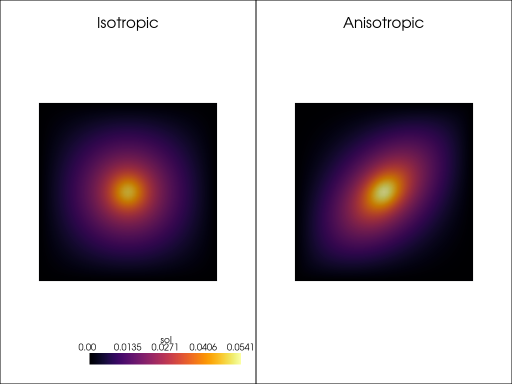

# Anisotropic Poisson

Now, we will discuss anisotropic diffusion of the Poisson equation. To account for anisotropic diffusion, a matrix is inserted in front of $\nabla u$ describes which directions are easiest for the value to move through. To demonstrate the diffusion, we will have a gaussian centered at (0.5, 0.5) as the forcing function to show the breaking of symmetry. Again, we will keep zero Dirichlet boundary values on the edges.

$$
\int_\Omega \mathbf{D} \nabla u \cdot \nabla v dV = \int_\Omega g(x) v dV
$$

## New Problem

We have defined a new problem by allowing for anisotropic diffusion. We also decided to change the mass map to appopriately display the differences. Now, let's make the change in the code. *Notice the insertion of the internal variable $\mathbf{D}$ in both the `tensor_map` and `mass_map`.* Also, the output of the mass_map should be an array, not a scalar, so we wrap it to ensure the correct shape.

```python
# Define the Poisson problem
class Poisson(Problem):

    # Defines the contraction between
    # \int \nabla u \cdot \nabla v dx
    # You're entering the "\nabla u" part, the "\cdot \nabla v" is fixed
    def get_tensor_map(self):

        def tensor_map(u_grad, D):
            return u_grad @ D

        return tensor_map
                
    # Define the source term f
    # For the Poisson problem, using eigenfunction here
    def get_mass_map(self):
        def mass_map(u, u_grad, x, D):
            val = -10 * np.exp(-5 * ((x[0] - 0.5) ** 2 + (x[1] - 0.5) ** 2) / (2 * 0.1 ** 2))
            return np.array([val])
        return mass_map
```

## Passing Internal Variables

Now, we define the problem the exact same as before, but now we have additional variables within the cell kernel computations. We define two tensors to represent the two problems we'd like to solve. 

```python
problem = Poisson({"u": fe}, dirichlet_bc_info=dirichlet_bc_info)
I = np.array([[1., 0.], [0., 1.]])
A = np.array([[1., 1.], [0., 1.]])
```

Now, we use the `set_internal_vars` method to appropriately set the constant field across the discretization. To ensure shapes work out most of the time, changing `problem.internal_vars` is protected and must be set through the designated method. 

```python
# Solve the problem
problem.set_internal_vars({"u": {"D": I}})
toc_I = time.time()
sol_I, info = solver.solve(atol=1e-6)
assert info[0]
tic_I = time.time()

problem.set_internal_vars({"u": {"D": A}})
toc_A = time.time()
sol_A, info = solver.solve(atol=1e-6)
assert info[0]
tic_A = time.time()

print("Isotropic solve time (including JIT): ", tic_I - toc_I)
print("Anisotropic solve time (JITTED): ", tic_A - toc_A)
```
Isotropic solve time (including JIT):  2.418884515762329
Anisotropic solve time (JITTED):  0.03272724151611328

## Jitting

If you were wondering why the previous demonstration felt slow, it's because JAX utilizes JIT compilation. This means that on the first run of the function, it is both computed and traced on the GPU for compilation. Each subsequent run of the problem that only changes FUNCTIONALLY then benefits from the compilation. *BE AWARE*, if you change a value within a jitted function that is not functional, it won't necessarily change the value as expected. We will revisit this quirk later on with the inverse problem.

