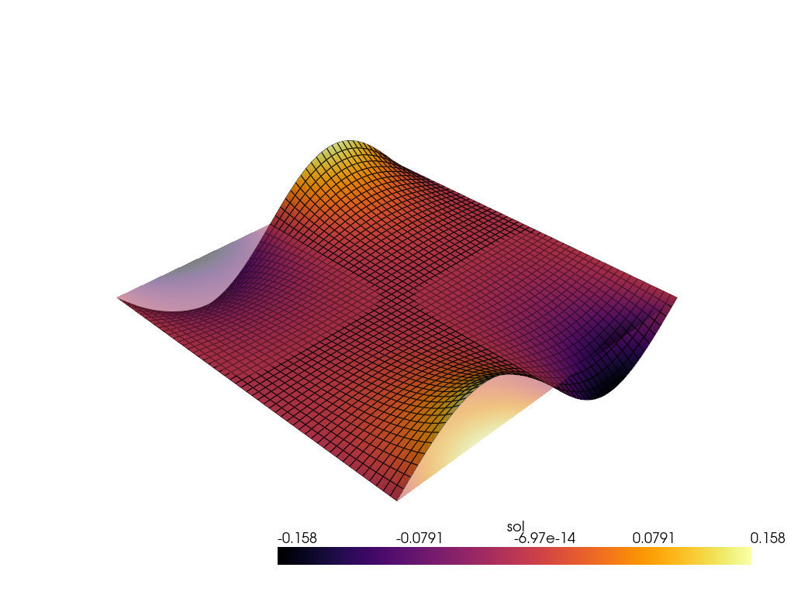

# Boundary Integrals

Now that we have solved the PDE with different mass functions and internal variables, we will move on to defining boundary integrals. This allows us to define Neumann and Robin type boundary conditions. We will now be going back to the original form of the PDE but set the forcing function to 0, solving Laplace. The boundary term will be a sinusoid on the top and bottom edges ${top, bottom} \in \Gamma_N$ while dirichlet value 0 on the left and right.

$$
\int_\Omega \nabla u \cdot \nabla v dV - \int_{\Gamma_N} v (\pm1 sin(2 \pi x)) dS = 0
$$

## Boundary PDE

To define the boundary integrals of the PDE, we must replace the surface maps accordingly. We have two boundary integrals, one for the bottom and top face. We define the two functions, taking care of the shape with the predefined inputs. The return value is now a dictionary specifying that the surface kernels apply to $u$, and then another dictionary saying which boundary the functions are assoicated with.

```python
# Define the Poisson problem
class Poisson(Problem):

    # This defines the kernel
    # \int \nabla u \cdot \nabla v dx
    # the "\cdot \nabla v" is fixed, so only provide the \nabla u
    def get_tensor_map(self):
        return lambda u_grad: u_grad
    
    # Define potential surface kernels
    # Just sinusoidal here
    def get_surface_maps(self):
        def surface_map1(u, u_grad, x):
            return -np.sin(2 * x[0] * np.pi).reshape(1,)

        def surface_map2(u, u_grad, x):
            return np.sin(2 * x[0] * np.pi).reshape(1,)

        return {"u": {"bottom": surface_map1, "top": surface_map2}}
```

## Location Functions

We leave the left and right boundaries alone because those are similar to the previous problems. We now define the `location_fns` which should match the dictionary passed in the `get_surface_maps` function except it will contain the location function designating where to apply the surface integral rather than the value function.

```python
# Combine BC info
bc_left = [[left], [0], [zero_bc]]
bc_right = [[right], [0], [zero_bc]]
dirichlet_bc_info = {"u": [bc_left, bc_right]}
location_fns = {"u": {"bottom": bottom, "top": top}}
```

## Problem Creation

Now we pass the `location_fns` to the problem class, so the functions needed to evaluate the surface integrals and add them to the assembly.

```python
problem = Poisson({"u": fe}, dirichlet_bc_info=dirichlet_bc_info, location_fns=location_fns)
```

```python
# Solve the problem
toc = time.time()
sol, info = solver.solve(atol=1e-6)
assert info[0]
print(f"Poisson solved in {time.time() - toc:.2f} seconds.")
```

Poisson solved in 2.96 seconds.

It takes a bit longer to solve this problem because we now have two surface functions that must be compiled as well as opposed to the other two examples where only internal cell-based functions were used, which only compiled 1 function.

