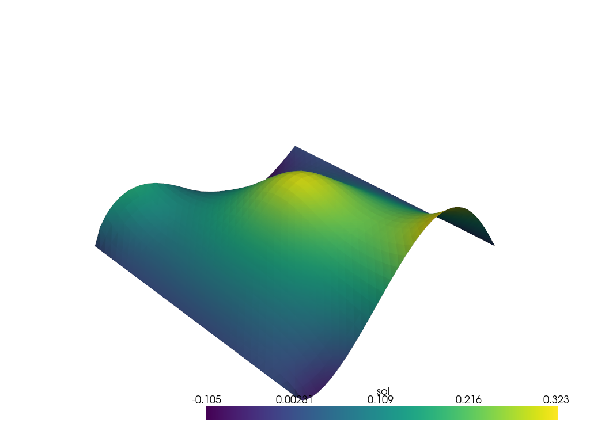

# Poisson Combined

We will now combine everything into this solve. There will be a changing diffusion coefficient along with evolving boundary integral terms, so we are solving the full PDE.

$$
\int_\Omega \nabla u \cdot \nabla v dV - \int_{\partial \Omega} v \nabla u \cdot \mathbf{n} dS = \int_\Omega f v dV
$$

## Problem Definition

Here, we have internal variables defining anisotropy through $D$ as well as changing surface integrals through $a$ with a gaussian forcing.

```python
# Define the Poisson problem
class Poisson(Problem):

    # This defines the kernel
    # \int \nabla u \cdot \nabla v dx
    # the "\cdot \nabla v" is fixed, so only provide the \nabla u
    def get_tensor_map(self):

        def tensor_map(u_grad, D):
            return u_grad @ D

        return tensor_map
    
    # Define the source term f
    # For the Poisson problem, using gaussian here
    def get_mass_map(self):
        def mass_map(u, u_grad, x, D):
            val = -3 * np.exp(-5 * ((x[0] - 0.5) ** 2 + (x[1] - 0.5) ** 2) / (2 * 0.1 ** 2))
            return np.array([val])
        return mass_map

    # Define potential surface kernels
    # Just sinusoidal here
    def get_surface_maps(self):
        def surface_map1(u, u_grad, x, a):
            return -np.sin(2 * a*x[0]*np.pi).reshape(1,)

        def surface_map2(u, u_grad, x, a):
            return np.sin(2 * a*x[0]*np.pi).reshape(1,)

        return {"u": {"bottom": surface_map1, "top": surface_map2}}
```

## FE Discretization

We keep a similar discretization but increase the order of the polynomial to quadratic insteaad of linear. This is why we have "quad8" and the gauss_order increased to 2.

```python
# Create the mesh and FE field
Lx, Ly = 1., 1.
mesh = rectangle_mesh(Nx=50, Ny=50, Lx=Lx, Ly=Ly, ele_type="quad8")
fe = FiniteElement(mesh, vec=1, dim=2, ele_type="quad8", gauss_order=2)
```

## Boundary Locations

These are the same as the boundary integral example.

```python
# Define boundary locations.
def left(point):
    return np.isclose(point[0], 0., atol=1e-5)

def right(point):
    return np.isclose(point[0], Lx, atol=1e-5)

def bottom(point):
    return np.isclose(point[1], 0., atol=1e-5)

def top(point):
    return np.isclose(point[1], Ly, atol=1e-5)

# Define boundary values to assign (homogeneous)
def zero_bc(point):
    return 0.

# Combine BC info
bc_left = [[left], [0], [zero_bc]]
bc_right = [[right], [0], [zero_bc]]
dirichlet_bc_info = {"u": [bc_left, bc_right]}
location_fns = {"u": {"bottom": bottom, "top": top}}
```

```python
problem = Poisson({"u": fe}, dirichlet_bc_info=dirichlet_bc_info, location_fns=location_fns)
```

```python
# Create instance of Newton_Solver
solver = Newton_Solver(problem, np.zeros((len(mesh.points), 1)))
```

## Extra Variables

To create a gif out of the solutions, we will vary the coefficient fields. The values of $a\in[-1, 1]$ and the values of diffusion will just add some anisotropy.

```python
### Creates variables to solve over
num_frames = 51
a_values = np.linspace(-1, 1, num_frames, endpoint=True)
a_values = np.hstack([a_values, a_values[::-1]])

@jax.vmap
def D_vals(t):
    return np.array([[1., .5*t], [.5*t, 1.]])

D_values = D_vals(a_values)
```

## Precompute
We first compute the initial call ahead of time to precompile the functions.

```python
# Solve the problem
toc_jit = time.time()
problem.set_internal_vars({"u": {"D": D_values[0]}})
problem.set_internal_vars_surfaces({"u": {"bottom": {"a": np.array([a_values[0]])}, "top": {"a": np.array([a_values[0]])}}})
sol0, info = solver.solve(atol=1e-6)
assert info[0]
tic_jit = time.time()
```



## Solve

We now solve many times varying the parameters before each call and tracking the list of solutions we receive.

```python
sols = []
toc = time.time()
for n in range(len(a_values)):
    problem.set_internal_vars({"u": {"D": D_values[n]}})
    problem.set_internal_vars_surfaces({"u": {"bottom": {"a": np.array([a_values[n]])}, "top": {"a": np.array([a_values[n]])}}})
    sol, info = solver.solve()
    assert info[0]
    sols.append(onp.array(sol))
tic = time.time()

print("Initial solve time:", tic_jit - toc_jit)
print("Total solve time for all frames:", tic - toc)
print("Average time per frame:", (tic - toc)/(len(a_values)))
```

Initial solve time: 3.23
Total solve time for all frames: 7.85
Average time per frame: 0.077

While it took longer to solve these problems because we increased the order to quadratic, we now have 7701 DoFs as opposed to the other examples with 2601 DoFs. Another major benefit for GPU solving is the scaling as long as the data stays on one GPU machine is very good. It still remains quite good across multiGPU codes, but again, we don't have that implemented.

